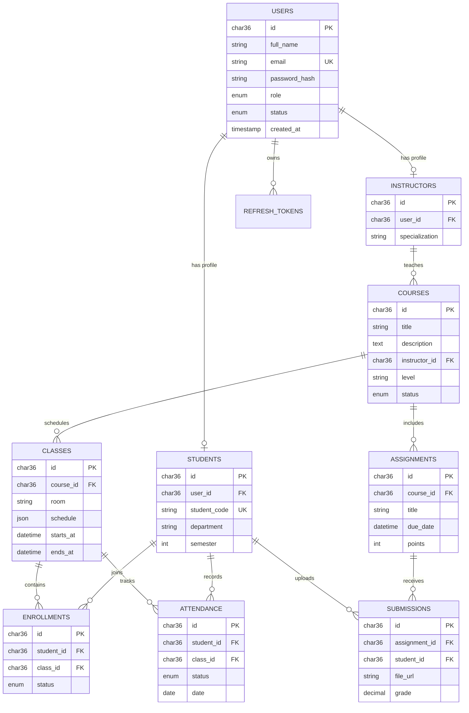

# EduCore ERD

MongoDB collections:

- `lessons`: dynamic lesson blocks and assets
- `notifications`: realtime and persisted notifications
- `activitylogs`: user activity history
- `announcements`: system and course announcements
- `cmscontents`: editable CMS pages
- `quizquestions`: flexible quiz structures

